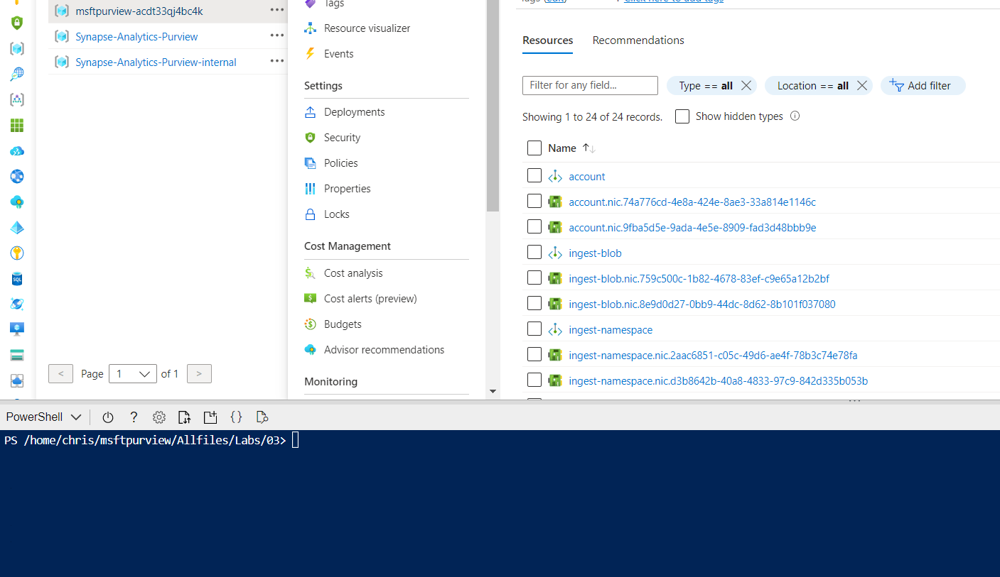

---
lab:
    title: 'Deploy a private Microsoft Purview account and restore a configuration'
    module: 'Microsoft Purview'
---

# Restore a Microsoft Purview Account

This exercise will have you create a Microsoft Purview deployment and then restore the settings from a previous Microsoft Purview account to simulate a disaster recovery procedure.

This lab will take approximately **45** minutes to complete.

## Before you start

You'll need an [Azure subscription](https://azure.microsoft.com/free) in which you have administrative-level access.

## Provision a Microsoft Purview Account

In this exercise, you'll use a combination of a PowerShell script and an ARM template to provision the Microsoft Purview account.

1. Sign into the [Azure portal](https://portal.azure.com).
2. Use the **[\>_]** button to the right of the search bar at the top of the page to create a new Cloud Shell in the Azure portal, selecting a ***PowerShell*** environment and creating storage if prompted. The cloud shell provides a command line interface in a pane at the bottom of the Azure portal, as shown here:

    

    > **Note**: If you have previously created a cloud shell that uses a *Bash* environment, use the the drop-down menu at the top left of the cloud shell pane to change it to ***PowerShell***.

3. Note that you can resize the cloud shell by dragging the separator bar at the top of the pane, or by using the **&#8212;**, **&#9723;**, and **X** icons at the top right of the pane to minimize, maximize, and close the pane. For more information about using the Azure Cloud Shell, see the [Azure Cloud Shell documentation](https://docs.microsoft.com/azure/cloud-shell/overview).

4. In the PowerShell pane, enter the following commands to clone this repo:

    ```powershell
    rm -r msftpurview -f
    git clone https://github.com/MicrosoftLearning/mslearn-purview msftpurview
    ```

5. After the repo has been cloned, enter the following commands to change to the folder for this lab and run the **setup.ps1** script it contains:

    ```powershell
    cd msftpurview/Allfiles/Labs/03

    Connect-AzAccount

    Select-AzSubscription "SubscriptionID"

    ./setup.ps1
    ```

6. Wait for the script to complete - this typically takes around 15 minutes, but in some cases may take longer.

## Restore a configuration

The following steps will execute a restore script that will restore various objects from a previous Microsoft Purview envrionment to the one you just created. After the restore is completed, you will then test that all of the items are present and working properly.

### Restore a Configuration

1. Run the following:

    ```powershell
    ./restore.ps1
    ```

2. Take some time to review the script, notice the various calls it makes to the Azure Control plane and the Microsoft Purview Atlas API endpoints to do the restore of variou objects.

### Test the configuration

1. After the script has completed, in the Azure portal, go to the **msftpurview-*xxxxxxx*** resource group that it created, and select your Microsoft Purview account.
2. Select the **mainSUFFIX** Microsoft Purview account.
3. On the **Ovewview** tab, select the **Open Microsoft Purview Governance Portal** `Open` link.
4. Select the **Data Map** tab, you should see the root collection and sevearl other collections.
5. Select the **Scan rule sets** link then select the **Custom** tab, you should see some custom scan rule sets imported.
6. Select the **Classification rules** link, then select the **Custom** tab, you should see a custom classification rule present.
7. Select the **Management** tab, then select **Data Factory**, you should see a data factory connection.
8. Select the **Credentials** item, you should see a `test` credential with a link to a Azure Key Vault.

## Delete Azure resources

If you've finished exploring restoring Microsoft Purview, you should delete the resources you've created to avoid unnecessary Azure costs.

1. Close the Microsoft Purview browser tab and return to the Azure portal.
2. On the Azure portal, on the **Home** page, select **Resource groups**.
3. Select the **msftpurview-*xxxxxxx*** resource group for your Synapse Analytics workspace (not the managed resource group), and verify that it contains the Synapse workspace and storage account for your workspace.
4. At the top of the **Overview** page for your resource group, select **Delete resource group**.
5. Enter the **msftpurview-*xxxxxxx*** resource group name to confirm you want to delete it, and select **Delete**. After a few minutes, your Microsoft Purview resource group and the managed workspace resource group associated with it will be deleted.
