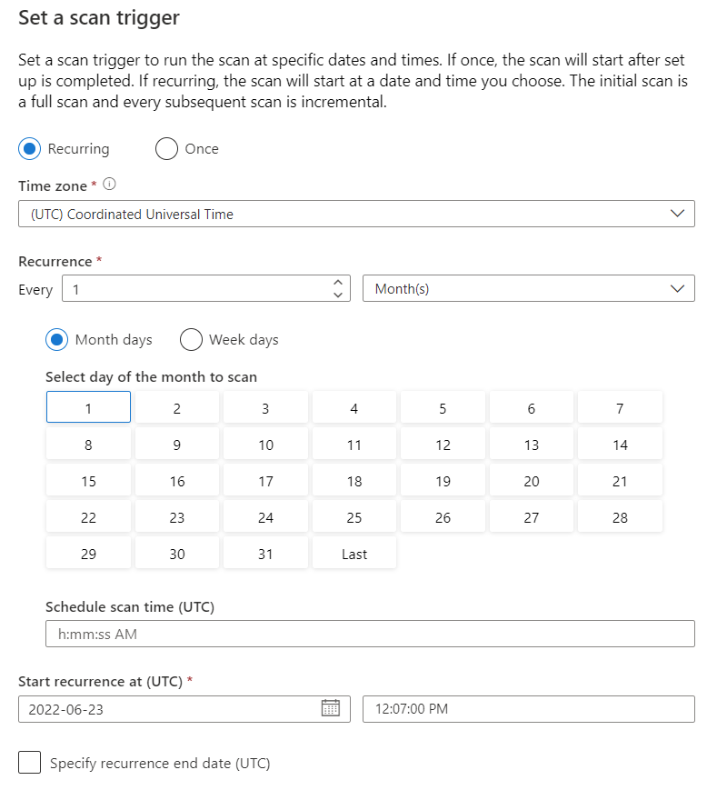

In this exercise, you will create a Microsoft Purview deployment, configure a data source to scan, and register an Azure Data Factory with data processing pipelines that use the data source. You will generate lineage data that can be browsed in Microsoft Purview.

## Before you start

You'll need an [Azure subscription](https://azure.microsoft.com/free) in which you have administrative-level access.

## Provision a Microsoft Purview account

In this exercise, you'll use a combination of a PowerShell script and an ARM template to provision the Microsoft Purview account.

1. Sign into the [Azure portal](https://portal.azure.com).
2. Use the **\[&gt;\_\]** button to the right of the search bar at the top of the page to create a new Cloud Shell in the Azure portal, selecting a ***PowerShell*** environment and creating storage if prompted. The Cloud Shell provides a command line interface in a pane at the bottom of the Azure portal, as shown here:

    

3. Take note that you can resize the Cloud Shell by dragging the separator bar at the top of the pane, or by using the **—**, **◻**, and **X** icons at the top right of the pane to minimize, maximize, and close the pane. For more information about using the Azure Cloud Shell, see the [Azure Cloud Shell documentation](https://docs.microsoft.com/azure/cloud-shell/overview).

4. In the PowerShell pane, enter the following commands to clone this repo:

    ```powershell
    rm -r msftpurview -f
    
    git clone https://github.com/MicrosoftLearning/mslearn-purview msftpurview
    ```

5. After the repo has been cloned, enter the following commands to change to the folder for this lab and run the **05-setup.ps1** script it contains:

    ```powershell
    cd msftpurview/Allfiles/Labs/05
    
    ./setup.ps1
    
    ```

6. Wait for the script to complete - this typically takes around 15 minutes, but in some cases may take longer.

## Scan a Data Source

The following steps will walk you through setting up a scan of a pre-created Azure Storage data source.

### Add Data Source

1. Open the Azure portal and browse to your lab resource group

    

2. Browse to your Microsoft Purview account and select it

    

3. On the **Overview** tab, select **Open Microsoft Purview Governance portal**

    

4. Select the **Data map** tab
5. Select **Register**

    

6. For the type, select **Azure Blob Storage**
7. Select **Continue**

    

8. Select your lab subscription
9. Select the **storageSUFFIX** storage account
10. Select the **(Root) mainSUFFIX** collection
11. Select **Register**

    

### Scan the Data Source

1. For the new data source, select the **New scan** icon

    

2. For the name, type **storageSUFFIX-scan-monthly**
3. Review the remaining settings

    

4. Select **Continue**
5. On the **Scope your scan** dialog, expand the **wwi-02** container
6. Select only the **customer-info** directory
7. Select **Continue**
8. For the rule set, select the **AzureStorage** rule set

    

9. Select **Continue**
10. On the **Set a scan trigger** dialog, select day **1**

    

11. Select **Continue**
12. Select **Save and run**
13. For the data source, select **View details**. You should see the scan is running and discovering assets.

## Register Azure Data Factory (ADF)

1. Select the **Management** tab
2. Under **Lineage connections**, select **Data Factory**

    

3. Select **New**
4. Select your lab subscription
5. Select the **mainSUFFIX** Azure Data Factory
6. Select **OK**

### Run ADF Pipeline

1. In the Azure portal, navigate to the **mainSUFFIX** Azure Data Factory

    

2. On the **Overview** page, select **Open Azure Data Factory Studio**

    

3. Select the **Author** tab
4. Under **Pipelines**, notice the **CustomerCopy** pipeline
5. Select the **CustomerCopy** pipeline, then select **Debug**. This will execute the pipeline and copy the CSV file from one place to another.

    

### Review Lineage

1. Once the pipeline has completed, select the **Lineage status** column of the pipeline run, you should see **Succeeded** as the status

    

2. Switch back to Microsoft Purview
3. Select the **Data map** tab
4. Select **Collections**, then select the root collection

    

5. Select the **Assets** tile, you should see the Azure Data Factory items displayed

    

6. Select the **customerinfo.csv** asset

    

7. Select the **lineage** tab, you should see the lineage displayed where the pipeline uses the information and then sends it to the **customerinfo-modifed.csv** file

    

## Delete Azure resources

If you've finished exploring restoring Microsoft Purview, you should delete the resources you've created to avoid unnecessary Azure costs.

1. Close the Microsoft Purview browser tab and return to the Azure portal.
2. On the Azure portal, on the **Home** page, select **Resource groups**.
3. Select the **msftpurview-*xxxxxxx*** resource group for your Synapse Analytics workspace (not the managed resource group), and verify that it contains the Synapse workspace and storage account for your workspace.
4. At the top of the **Overview** page for your resource group, select **Delete resource group**.
5. Enter the **msftpurview-*xxxxxxx*** resource group name to confirm you want to delete it, and select **Delete**. After a few minutes, your Microsoft Purview resource group and the managed workspace resource group associated with it will be deleted.
